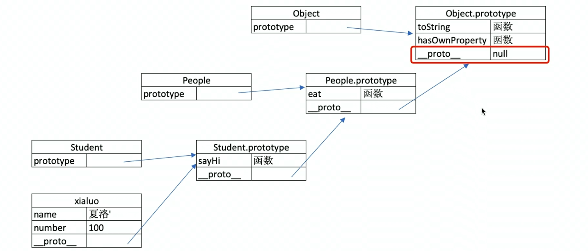

# js基础

### 变量类型和计算

* 题目：
  * typeof能判断哪些类型
  * == 和 ===
  * 值类型和引用类型的区别
  * 手写深拷贝 

* 值类型和引用类型

  * 基本类型：Undefined、Null、Boolean、Number、String、Symbol
  * 引用类型：Object 类型、Array 类型、Date 类型、RegExp 类型、Function 类型等等
  * js将值类型（基本类型）的存于**栈**中，将引用类型存于**堆**中。只是将引用类型的内存地址存于栈中。
  * 把一个值类型（基本类型）赋值给另一个变量时，其实是分配了一块新的内存空间，因此改变str1的值对str2没有任何影响，因为它不同于*引用类型*(变量的交换其实是交换了指向同一个内容的地址)。 
  * 引用类型的比较是**引用的比较**，即比较两个对象的**堆内存中的地址是否相同**

* **typeof**运算符

  * 用来检测一个变量是不是**基本的数据类型**
  * 能识别识别所有的值类型
  * **识别函数**
  * 判断是否是引用类型（不可细分）
  * **typeof null 为 object**

    * 原因：简单来说，`typeof null`的结果为`Object`的原因是一个`bug`。在 `javascript` 的最初版本中，使用的 `32`位系统，`js`为了性能优化，使用低位来存储变量的类型信息。在判断数据类型时，是根据机器码低位标识来判断的，**而null的机器码标识为全0**，而对象的机器码低位标识为000。所以`typeof null`的结果被误判为Object。

* **浅拷贝与深拷贝**

  ```js
  
  /**
   * 浅拷贝指的是将一个对象的属性值复制到另一个对象，如果有的属性为引用类型的话，那么将这个引用的地址复制给对象，
   * 浅拷贝还可以使用Object.assign和展开运算符来实现
   */
  
  function shallowCopy(object) {
      //只拷贝对象
      if (!object || typeof object !== "object") return
  
      //判断新建的object是对象还是数组
      let newObject = Array.isArray(object) ? [] : {}
  
      for (let key in object) {
          if(object.hasOwnProperty(key)){
               newObject[key] = object[key];
          }
      }
      return newObject
  }     
  
  
  /**
   * 对于深拷贝，如果遇到属性值为引用对象，则新建一个引用类型并将对应的值赋给他
   * 遇到对象则递归
   */
  
  function deepCopy(object) {
      if (!object || object === 'object') { return }
  
      let newObject = Array.isArray(object) ? [] : {}
  
      for (let key in object) {
          if (object.hasOwnProperty(key)) {
              newObject[key] = 
              typeof object[key] === "object" ? deepCopy(object[key]) : object[key]
          }
      }
      return newObject
  }
  ```

* 0.1+0.2为什么不等于0.3？

  * JavaScript使用Number类型表示数字（整数和浮点数），遵循 [IEEE 754](https://zh.wikipedia.org/wiki/IEEE_754) 标准 通过64位来表示一个数字
  * **运算过程中先按照IEEE 754转成相应的二进制，然后对阶运算**，0.1和0.2**进制转换**转换后会无限循环，截掉多余的位数后会精读丢失，由于指数位数不相同，运算时需要**对阶运算** ，这部分也可能产生精度损失
  * 解决：将浮点数转换为整数来进行计算。根据业务避免这样的代码。使用math.js库

* '1'.toString()为什么可以调用

  * ```js
    var s = new String('1');
    s.toString();
    s = null;
    ```

  1. 创建String实例

  2. 调用实例方法

  3. 执行完方法后销毁这个实例

  * 整个过程体现了**基本包装类型**的性质，而基本包装类型恰恰属于基本数据类型，包括Boolean, Number和String。

* **instanceof**

  * 判断引用类型（对象数据类型)

  * instanceof的原理是基于**原型链**的查询

  * 直接：{} instanceof Object会报错。js将{}识别为代码块

  * 对于基本数据类型不能准确判断

    >  111 instanceof Number -> false 同样的还有"xx"和true, 因为字面量值不是实例, new Number() 才是

  * **手写instanceof**

    ```js
    function myInstaceof(left, right) {
        if (typeof left !== 'object' || left === null) return false
        //getPrototypeOf可以拿到对象的原型对象
        let proto = Object.getPrototypeOf(left)
    
    
        while (true) {
            //查找至原型链尽头，如果为null则没有查找到
            if (proto === null) return false
            //查找到了则返回true
            if (proto === right.prototype) return true
            //没有找到则一直向上查找
            proto = Object.getPrototypeOf(proto)
        }
    }
    ```

### 跨域

* 参考[跨域](https://juejin.cn/post/6844903816035319815#heading-1)

### 原型链

> 那什么是原型呢？你可以这样理解：每一个JavaScript对象(null除外)在创建的时候就会与之关联另一个对象，这个对象就是我们所说的原型，每一个对象都会从原型"继承"属性。

* 每个**对象**都有一个__ proto __（隐式原型）属性，该属性指向该对象的原型
* 每个**函数**（类）都有一个 prototype（显式原型） 属性，函数的 prototype 属性指向了一个对象，
* 函数的 prototype 属性指向了一个对象，这个对象正是调用该构造函数而创建的**实例**的原型
* constructor有原型指回构造函数
* 总结：**构造函数的 prototype 指向原型对象，原型对象有一个 constructor 属性指回构造函数，每个构造函数生成的实例对象都有一个 *proto* 属性，这个属性指向原型对象。**
* **原型的原型**。原型也是一个对象，所有也有原型。它的隐式原型(__ proto __)最终指向Object.prototype。Object.prototype的隐式原型指向null
* 通过__ proto __相互关联起来的原型组成的链状结构就是原型链
* 
* 
* 

### 作用域和自由变量

- 作用域
  - 全局作用域
  - 函数作用域
  - 块级作用域（es6）
- 自由变量
  - 一个变量在当前作用域没有定义但是被使用了
  - 向上级作用域，一层一层寻找，直到找到了为止
  - 如果到了全局作用域还是没找到，就会报错 is not define

### 闭包

> 闭包就是能够读取其他函数内部变量的函数。定义在一个函数内部的函数由于在Javascript语言中，只有函数内部的子函数才能读取局部变量，因此可以把闭包简单理解成"定义在一个函数内部的函数"。 ——阮一峰
>
> 闭包是函数和声明该函数的词法环境的组合。 ——MDN

* 一句话总结：闭包就是是由函数以及该函数创建时的词法环境组合而成的。这个环境包含了函数**创建时**能访问的所有局部变量

* 只有变量的查找是在**函数定义（创建）的地方**，向上级作用域寻找，而不是在执行的地方

* 闭包的**用途**：闭包可以用在许多地方。它的最大用处有两个

  * 一个是前面提到的可以读取**函数内部的变量**。

  * 另一个就是让这些变量的值始终**保持**在**内存**中。

  * **隐藏数据，模拟私有变量和私有方法**

    ```js
    function createCache(){
        const data = {}
      return {
          set:funtion(key,val){
              data[key] = val
          }
          get:funtion(key){
              return data[key]
          }
      }
    }
    ```

    

* 两种表现形式：

  * 函数作为返回值

    ```js
    function create(){
        let a = 100
        return funtion(){
            console.log(a)
        }
    }
    
    let fun = create()
    let a = 200
    fun() //100
    ```

    

  * 函数作为参数被传递

    ```js
    function print(fn){
        const a = 200
        fn()
    }
    const a = 100
    function fn(){
        console.log(a)
    }
    print(fn)  //100
    ```

### this

五种使用场景，this的值是在执行时决定的，而不是定义

- 作为普通函数 。指向全局window
- 使用call apply bind 调用。obj.b.apply(object, []); // this指向当前的object
  - 手写bind
- 作为对象方法被调用，指向该对象 obj.b(); // 指向obj
- class中调用 //指向当前class
- 箭头函数中的this //() =>{} //this指向当前对象
-  作为构造函数调用 var b = new Fun(); // this指向当前实例对象

### 异步和单线程

* 单线程：只能同时做一件事。异步是因为单线程而产生的。比如说遇到等待（定时器，网络请求，图片加载等）不能卡组，异步是为了解决单线程等待的问题，异步不会阻塞代码的执行
* 异步和同步的区别
  * 异步是基于js单线程的
  * 异步不会阻塞代码的执行
  * 同步会阻塞代码的执行
* Promise并不是避免了回调函数。而是把回调函数变成了串联的形式。

### DOM

- DOM的本质是从html语言解析出来的树型结构

- dom节点操作

  - 获取dom节点

    - document.getElementById('id') //元素
    - getElemenstByTagName('div') //集合
    - getElementsByClassName() //集合
    - querySelectorAll()

  - property 

    - style
    - classname
    - nodeType
    - nodeName

  - attribute //设置一个标签的属性

    - setAttribute('key','value')
    - getAttribute('key')

  - 区别：property修改对象属性，不会体现到html中，attribute修改html属性，会改变html属性。两者都可能引起dom重新渲染

  - 新建节点

    - createElement('')

  - 插入新节点

    - appendChild()

  - 获取父元素

    - p1.parentNode

  - 获取子元素

    - childNodes

  - 删除节点

    - const  child = div1.childNodes

      div1.removeChild(child[0])

- DOM性能

  - 避免频繁操作dom

  - 对DOM查询做缓存。比如每次for循环都要查询dom的长度，可先计算dom的长度，而不是在for语句中查询dom长度

  - 将频繁操作改为一次性操作 

    - 创建一个文档片段，先插入到文档片段中，不在for循环中插入到dom树中，**document.createDocumentFragment()**

      ```js
      const list = document.getElementById('list')
      
      // 创建一个文档片段，此时还没有插入到 DOM 结构中
      const frag = document.createDocumentFragment()
      
      for (let i  = 0; i < 20; i++) {
          const li = document.createElement('li')
          li.innerHTML = `List item ${i}`
      
          // 先插入文档片段中
          frag.appendChild(li)
      }
      
      // 都完成之后，再统一插入到 DOM 结构中
      list.appendChild(frag)
      
      console.log(list)
      ```

      

### BOM

- navigator

  - navigator.userAgent 拿到浏览器信息

    ```
    navigator.userAgent.indexof('Chrome') //返回Boolean。判断是否是chrome
    ```

    

- screen 屏幕相关属性

  - screen.height,screen.width

- location 地址相关属性

  - location.href //整个url
  - location.protocol //协议
  - location.pathname
  - location.search //?后的内容
  - locaton.hash //#后的内容

- history 

### 事件

- 题目
  - 编写一个通用的事件监听函数
  - 描述事件冒泡流程
  - 无限下拉的图片列表，如何监听每个图片的点击
- **事件绑定**
  - addEventListener('click', e => { do something...}) //e为事件对象,e.target可以获取触发的元素
    - **第三个参数**：第三个参数默认值是false，表示在**事件冒泡**阶段调用事件处理函数;如果参数为true，则表示在**事件捕获**阶段调用处理函数。
  - event.preventDefault() //阻止默认行为
- **事件冒泡**
  - 事件会从最内层的元素开始发生，一直向上传播，直到document对象，在此期间都可以监听到事件
  - react中子元素的onClick事件如果不阻止，也会触发父元素的onClick事件
- **事件捕获**
  - 和事件冒泡的顺序相反
- **事件代理（委托）**
  - 把一个或者一组元素的事件委托到它的父层或者更外层元素上，真正绑定事件的是外层元素，利用事件冒泡来处理
  - 代码简介
  - 减少浏览器内存占用

### ajax

- 题目

  - 手写一个简易的ajax 
  - 跨域的常用方式

- XMLHttpRequest

  ```js
  const xhr = new XMLHttpRequest
  xhr.open('GET', 'https://www.baidu.com')
  xhr.onreadystatechange = function () {
      if (xhr.readyState === 4) {
          if (xhr.status === 200) {
              console.log(xhr.responseText)
          }
      }
  }
  
  xhr.send(null)
  ```

  

- 状态码

  - readyState
    - 0 － （未初始化）还没有调用send()方法
    - 1 － （载入）已调用send()方法，正在发送请求
    - 2 － （载入完成）send()方法执行完成，已经接收到全部响应内容
    - 3 － （交互）正在解析响应内容
    - 4 － （完成）响应内容解析完成，可以在客户端调用了
  - xhr.status
    - 2xx - 表示成功处理请求 ，如200
    - 3xx - 表示需要重定向，浏览器直接跳转 如301 302 304
    - 4xx - 客户端请求错误 ，如403 404
    - 5xx - 服务端错误 如500 

### 跨域

- 同源策略：同源：协议，端口，域名三者必须一致

- **jsonp跨域：**

  - 浏览器要求当前网页和server必须同源 ，加载css，js可以无视同源策略如，,<link href = ''/>,<script scr=''/>

  - 同样script可以实现jsonp，服务端可以任意动态拼接数据返回，需要服务端配合，但是只能get请求

  - Step1: 创建 callback 方法

    Step2: 插入 script 标签

    Step3: 后台接受到请求，解析前端传过去的 callback 方法，返回该方法的调用，并且数据作为参数传入该方法

    Step4: 前端执行服务端返回的方法调用

  - script中预先定义函数，再通过通过下个script中返回的触发回调函数

    ```html
    <script>
    	window.callback = function(data){
            console.log(data)
    	}
    <script/>
    <script scr = 'https://xxx.com/xxx.js'>
    <script/>
    //xxx.js
     callback({a:'xxx'})
    ```

- CORS跨域-服务器设置http header

  - ```js
    app.use((req, res, next) => {
        res.setHeader('Access-Control-Allow-Origin', 'XXX'); //允许跨域的url
        res.setHeader('Access-Control-Allow-Headers', 'XXX'); //允许返回的头
        res.setHeader('Access-Control-Allow-Methods', 'XXX');//允许使用put方法请求接口
        res.setHeader('Access-Control-Max-Age', 6); //预检的存活时间
        if(req.method === "OPTIONS") {
            res.end(); //如果method是OPTIONS，不做处理
        }
    });
    ```

- nginx反向代理

  - ```nginx
    location / {
     add_header Access-Control-Allow-Origin *;
     add_header Access-Control-Allow-Methods 'GET, POST, OPTIONS';
     add_header Access-Control-Allow-Headers 'DNT,X-Mx-ReqToken,Keep-Alive,User-Agent,XRequested-With,If-Modified-Since,Cache-Control,Content-Type,Authorization';
     if ($request_method = 'OPTIONS') {
     return 204;
     }
    }
    ```

- websocket

  - Websocket 是 HTML5 的一个持久化的协议，它实现了浏览器与服务器的全双工通信，同时也是跨域的一种解决方案。Websocket 不受同源策略影响，只要服务器端支持，无需任何配置就支持跨域。

- postMessage

  - postMessage 通过用作前端页面之前的跨域，如父页面与iframe页面的跨域。window.postMessage方法，允许跨窗口通信，不论这两个窗口是否同源。

- 参考[跨域](https://github.com/YvetteLau/Blog/issues/21)

- 手写简易ajax

  ```js
  // const xhr = new XMLHttpRequest
  // xhr.open('GET', 'https://www.baidu.com')
  // xhr.onreadystatechange = function () {
  //     if (xhr.readyState === 4) {
  //         if (xhr.status === 200) {
  //             console.log(xhr.responseText)
  //         }
  //     }
  // }
  
  // xhr.send(null)
  
  function ajax(url) {
      const p = new Promise((resolve, reject) => {
          const xhr = new XMLHttpRequest()
          xhr.open('GET', url, true)
          xhr.onreadystatechange = function () {
              if (xhr.readyState === 4) {
                  if (xhr.status === 200) {
                      resolve(xhr.responseText)
                  } else if (xhr.status === 404) {
                      reject('404 NOT FOUND')
                  } else {
                      reject('NETWORK ERROR')
                  }
              }
          }
          xhr.send(null)
      })
      return p
  }
  
  let res = ajax('https://www.baidu.com')
  res.then(res2 => {
      console.log(res2)
  })
  ```

- fetch

  - `fetch()` 返回的 Promise **不会被标记为 reject，** 即使响应的 HTTP 状态码是 404 或 500

  - fetch()可以接受跨域cookies

  - fetch()不会发送cookies

  - 简易的fetch()

    ```js
    fetch('http://example.com/movies.json')
      .then(function(response) {
        return response.json();
      })
      .then(function(myJson) {
        console.log(myJson);
      });
    ```

### 浏览器储存

- cookie
  - 本身用于浏览器和server的通讯
  - 被'借用'到本地存储
  - 服务端也可以修改cookie
  - 前端通过document.cookie = 'xxx' 修改cookie
- localStorage

  - 是HTML5提供两种在客户端存储资料的方法，已经解决了cookie存储量小，无法使用的大量资料本地存储的问题。
- sessionStorage

  - 从字面的意思就可以裁剪，sessionStorage将资料储存在session中，浏览器关闭也就没了；而localStorage则一直将数据存储在客户端本地；无论是sessionStorage，还是localStorage，可使用的API都相同。
  - 都是使用键/值对的方式给值或取值
  - 大小预设有5mb
  - 每次要求不会带上
- 为什么要使用这个技术栈，对比其他的技术，有什么优势，自己的取舍
- 项目优化，白屏问题 ，用户体验问题，错误处理 ，服务端渲染，权限路由设计，骨架屏
- 发现问题  调研问题  找到解决方案 融合自己的想法 落地

  - new操作进行的步骤
  - call & bind & apply
  - caller / callee
  - 柯里化(**尾递归优化**) & 函数式编程
  - 类数组
  - isNaN() 和 Number.isNaN()
  - Obejct.is() 的不符直觉的处理（扩展：React的`ShallowEqual`底层对Object.is()进行了优化, 见[shallowEqual.js](https://github.com/facebook/react/blob/a9b035b0c2b8235405835beca0c4db2cc37f18d0/packages/shared/shallowEqual.js)）

